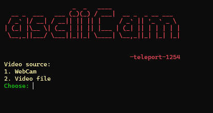

## Python ASCII Video/Camera Feed Player

This project is a Python-based application that allows you to play videos or live camera feeds in ASCII art format. It converts video frames or camera frames into ASCII characters.



## Features

-   Play pre-recorded video files in ASCII art format.
-   Live camera feeds in real-time using ASCII art.
-   Supports various video formats, including popular ones like MP4, AVI, and more.

## Requirements

-   Python 3.x
-   OpenCV library (opencv-python)
-   PIL library (pillow)
-   Additional dependencies listed in requirements.txt

## Installation
1. Clone this repository to your local machine:

    ```bash
    git clone https://github.com/teleport-1254/asciiCam
    ```

2. Navigate to the project directory:

    ```bash
    cd asciiCam
    ```

3. Install the required dependencies:
    ```bash
    pip install -r requirements.txt
    ```

## Usage
1. Run main.py
    ```bash
    py main.py
    ```

